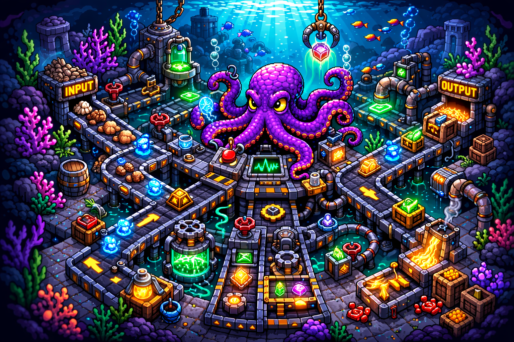

<p align="center">
  
</p>

# 🐙 Tentacles

**An open-source, agent-ready operational backbone built in Notion.**

Tentacles is 8 interconnected Notion databases that track everything from strategic initiatives to individual tasks. It ships with a Claude AI agent that onboards you by building your actual system — learn by doing — then becomes your production operations agent. Five minutes from zero to a fully wired ops system with your first real ticket and task already in it.

[](LICENSE)
[](https://notion.so)

---

## What You Get

- **8 pre-built, interconnected Notion databases:**
  - 🎫 Tickets — universal intake for all work
  - ✅ Tasks — execution layer, spawned from tickets
  - 📁 Engagements — client engagement tracking
  - 🚀 Initiatives — strategic pipeline with RICE scoring
  - 🧩 Internal Projects — internal project delivery
  - 💼 Clients — client/lead CRM
  - 🤝 Partnerships — external partner relationships
  - 📊 OKRs — strategic objectives and key results
- **A Claude AI agent** that handles onboarding AND daily operations — same agent, two modes
- **Ticket-first workflow:** every piece of work starts as a ticket, tasks spawn from tickets, everything cross-links across all 8 databases
- **Pre-built views, formulas, and relations** — no manual Notion setup required
- **5-minute setup** via a guided onboarding conversation
- **Effort Logging** *(v1.2)* — time tracking on tasks with Hours Spent and Hours Estimated
- **Proactive Alerting** *(v1.2)* — 10 configurable health checks with severity levels that the agent runs automatically
- **Capacity Planning** *(v1.2)* — per-user sprint load tracking with an assignment guard to prevent overloading

---

## Quickstart

### 1. Duplicate the Notion Template

Click **[Duplicate into Notion →](https://tentacles-manager.notion.site/Tentacles-Management-Layer-3276026675c5817f9668eb0c557689fe)** then click **Duplicate** in the top-right corner. All 8 databases, schemas, views, formulas, and relations transfer automatically.

### 2. Create a Claude Project

Go to [claude.ai](https://claude.ai) → Projects → New Project. Name it whatever you want.

- Connect the **Notion MCP integration**: in the project, click the integrations icon, search for "Notion", and authorize access to your workspace.
- Add the **system prompt**: open [`agent/system-prompt.md`](agent/system-prompt.md), copy the entire contents (including the `<tentacles_operating_system>` tags), and paste it into your project's Custom Instructions.

### 3. Say Hello

Open your Claude Project and type `hello tentacles` or `let's set up`. The agent walks you through the rest in about 5 minutes — it finds your databases, sets up your project codes, and creates your first real ticket and task.

---

## How It Works

<p align="center">
  
</p>

Tentacles uses a two-mode architecture. With no config file in Project Knowledge, the agent runs **onboarding mode**: it discovers your databases, asks a few questions, personalizes your setup, teaches you the system by creating real data, and generates a config JSON. Once you upload that config to Project Knowledge, the agent switches to **operations mode** and uses the stored IDs, enums, and conventions to operate without re-discovery.

The core philosophy is **ticket-first**: every piece of work — client requests, internal projects, agent-initiated tasks — starts as a ticket. Tasks spawn from tickets. Everything cross-links. The agent enforces this consistently.

---

## The 8 Databases

| Database | Role | Key Relations |
|----------|------|---------------|
| 🎫 Tickets | Universal intake — every request starts here | → Tasks, Engagements, Initiatives, Projects, Clients |
| ✅ Tasks | Execution layer — spawned from tickets | → Tickets, Projects, Engagements, OKRs |
| 📁 Engagements | Client engagement tracking | → Tickets, Clients |
| 🚀 Initiatives | Strategic pipeline & RICE scoring | → Tickets, Clients, Engagements, OKRs |
| 🧩 Internal Projects | Internal project delivery | → Tickets, Tasks, Initiatives, OKRs |
| 💼 Clients | Client/lead CRM | → Tickets |
| 🤝 Partnerships | External partner relationships | → Clients, Initiatives |
| 📊 OKRs | Strategic objectives & key results | → Engagements, self-referencing |

---

## Project Structure

```
tentacles/
├── README.md
├── LICENSE
├── SETUP.md
├── UPGRADING.md
├── CHANGELOG.md
├── brand/
│   ├── README.md
│   ├── 01-database-cubes.png
│   ├── 02-security-guard.png
│   ├── 03-octopus-bold.png
│   ├── 04-octopus-soft.png
│   ├── 05-octopus-servers.png
│   ├── 06-octopus-oscilloscope.png
│   ├── 07-contemplative.png
│   ├── 08-team-crew.png
│   ├── 09-partnership-whale.png
│   └── 10-workflow-factory.png
├── notion-template/
│   └── TEMPLATE_LINK.md
├── agent/
│   ├── system-prompt.md
│   └── config-template.json
├── docs/
│   ├── architecture.md
│   ├── project-codes.md
│   ├── workflows.md
│   ├── enum-reference.md
│   ├── troubleshooting.md
│   └── agent-patterns.md
└── examples/
    ├── sample-config.json
    └── sample-prompts.md
```

---

## Documentation

| Doc | Description |
|-----|-------------|
| [`docs/architecture.md`](docs/architecture.md) | Database schemas, relation map, agent architecture, and config file structure |
| [`docs/project-codes.md`](docs/project-codes.md) | How project codes work, standard suffixes, and client codes |
| [`docs/workflows.md`](docs/workflows.md) | The 5 standard workflows with step-by-step breakdowns |
| [`docs/enum-reference.md`](docs/enum-reference.md) | Complete reference of all valid enum values across all 8 databases |
| [`docs/troubleshooting.md`](docs/troubleshooting.md) | Common issues and how to fix them |
| [`docs/agent-patterns.md`](docs/agent-patterns.md) | Practical workflows and prompts you can use with the agent |
| [`docs/v1.2-release-spec.md`](docs/v1.2-release-spec.md) | Full specification for v1.2 features: Effort Logging, Proactive Alerting, Capacity Planning |

---

## Requirements

- A Notion workspace (free tier works)
- A Claude Pro or Team account (required for Projects and the Notion MCP integration)
- ~5 minutes for initial setup

---

## Upgrading

Already using Tentacles? See [UPGRADING.md](UPGRADING.md) for how to get the latest version. The agent handles schema migrations automatically — you just swap in the new system prompt.

---

## Contributing

Issues and PRs are welcome. See [`docs/architecture.md`](docs/architecture.md) for a detailed breakdown of the system design before contributing. Keep changes focused — this is an ops tool, not a framework.

---

## License

MIT — see [`LICENSE`](LICENSE).
