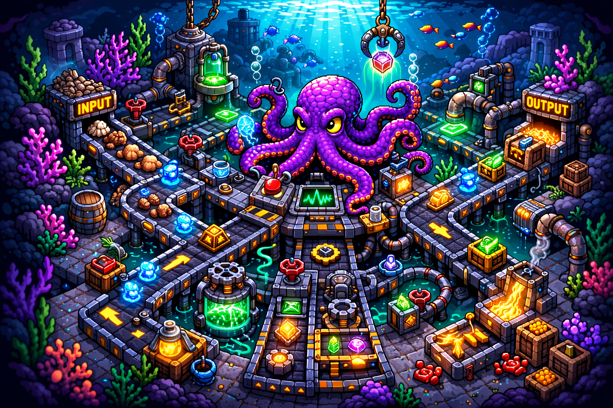

<p align="center">
  
</p>

# 🐙 Tentacles

**An open-source, agent-ready operational backbone built in Notion.**

Tentacles is a set of interconnected Notion databases — 8 in the base template, extensible with your own — that track everything from strategic initiatives to individual tasks. It ships with a Claude AI agent that onboards you by building your actual system — learn by doing — then becomes your production operations agent. Fifteen to thirty minutes from zero to a fully wired ops system with your first real ticket and task already in it.

[](LICENSE)
[](https://notion.so)

---

## What You Get

- **8 pre-built, interconnected core databases** (add your own — see [`docs/extending.md`](docs/extending.md)):
  - 🎫 Tickets — universal intake for all work
  - ✅ Tasks — execution layer, spawned from tickets
  - 📁 Engagements — client engagement tracking
  - 🚀 Initiatives — strategic pipeline with RICE scoring
  - 🧩 Internal Projects — internal project delivery
  - 💼 Clients — client/lead CRM
  - 🤝 Partnerships — external partner relationships
  - 📊 OKRs — strategic objectives and key results
- **A Claude AI agent** that handles onboarding AND daily operations — same agent, two modes
- **Ticket-first workflow:** every piece of work starts as a ticket, tasks spawn from tickets, everything cross-links across all your databases
- **Pre-built views, formulas, and relations** — no manual Notion setup required
- **Guided setup (15–30 minutes)** via an onboarding conversation
- **Effort Logging** — time tracking on tasks with Hours Spent and Hours Estimated fields, auto-populated from effort estimates, with time rollups across tickets, projects, and engagements
- **Proactive Alerting** — 10 configurable health checks (stale tickets, overloaded assignees, sprint overflow, and more) with Critical/Warning/Info severity and auto-ticketing for critical issues
- **Capacity Planning** — per-user sprint load tracking with an assignment guard that warns before overloading someone, plus velocity tracking across sprints
- **Granular Dives** — Structured deep work sessions (research, decision matrices, project plans, audits) with resumable child databases

---

## Quickstart

### 1. Duplicate the Notion Template

Click **[Duplicate into Notion →](https://tentacles-manager.notion.site/Tentacles-Management-Layer-3276026675c5817f9668eb0c557689fe)** then click **Duplicate** in the top-right corner. All 8 core databases, schemas, views, formulas, and relations transfer automatically.

### 2. Create a Claude Project

Go to [claude.ai](https://claude.ai) → Projects → New Project. Name it whatever you want (e.g., "Ops Agent").

### 3. Connect the Notion integration

- Go to [claude.ai/settings/connectors](https://claude.ai/settings/connectors)
- Click **Browse Connectors**
- Find **Notion** under the Web category (or search for it)
- Click the **+** icon next to Notion, then click **Connect**
- You'll be redirected to Notion — log in and select the workspace where you duplicated the template
- Authorize access and you're connected

> **Note:** Connectors are available on all Claude plans, including Free. Once connected, the Notion integration works across all your Claude Projects — you only need to do this once.

### 4. Add the system prompt

- Open [`agent/system-prompt.md`](agent/system-prompt.md) from this repo (view raw)
- Copy the entire contents
- In your Claude Project, click the ⚙️ gear icon at the top-right
- Find **Instructions** and paste the system prompt

### 5. Say Hello

Open your Claude Project and type `hello tentacles` or `let's set up`. The agent walks you through the rest in about 15–30 minutes — it finds your databases, sets up your project codes, and creates your first real ticket and task.

---

## How It Works

<p align="center">
  
</p>

Tentacles uses a two-mode architecture. With no config file in Project Knowledge, the agent runs **onboarding mode**: it discovers your databases, asks a few questions, personalizes your setup, teaches you the system by creating real data, and generates a config JSON. Once you upload that config to Project Knowledge, the agent switches to **operations mode** and uses the stored IDs, enums, and conventions to operate without re-discovery.

The core philosophy is **ticket-first**: every piece of work — client requests, internal projects, agent-initiated tasks — starts as a ticket. Tasks spawn from tickets. Everything cross-links. The agent enforces this consistently.

---

## The 8 Core Databases

| Database | Role | Key Relations |
|----------|------|---------------|
| 🎫 Tickets | Universal intake — every request starts here | → Tasks, Engagements, Initiatives, Projects, Clients |
| ✅ Tasks | Execution layer — spawned from tickets | → Tickets, Projects, Engagements, OKRs |
| 📁 Engagements | Client engagement tracking | → Tickets, Clients |
| 🚀 Initiatives | Strategic pipeline & RICE scoring | → Tickets, Clients, Engagements, OKRs |
| 🧩 Internal Projects | Internal project delivery | → Tickets, Tasks, Initiatives, OKRs |
| 💼 Clients | Client/lead CRM | → Tickets |
| 🤝 Partnerships | External partner relationships | → Clients, Initiatives |
| 📊 OKRs | Strategic objectives & key results | → Engagements, self-referencing |

---

## What goes in your Claude Project's Files

The agent reads everything in the project's **Files** section (⚙️ gear icon → Files → **+**) at runtime, so only the operating kit belongs there:

| Upload | File | Why |
|---|---|---|
| **Yes** | Your generated config (`<prefix>-tentacles-config.json`, first key `"tentacles_config": true`) | The mode switch — the agent generates it at the end of onboarding |
| **Yes, recommended** | [`docs/agent-patterns.md`](docs/agent-patterns.md) | Library of workflows the agent can suggest and run — briefings, triage, rollups, sprint planning, dives |
| Only if migrating | [`docs/migration.md`](docs/migration.md) | Extra detail on schema mapping and incremental sync (the prompt already contains Migration Mode) |

**Do not upload** `agent/config-template.json`, `examples/sample-config.json`, `docs/v1.2-release-spec.md`, `docs/granular-dives-spec.md`, `docs/architecture.md`, or anything under `docs/history/` or `docs/process/`. They are repo docs for humans: the template and sample carry placeholder or fake IDs, and the specs contain superseded schema blocks. A file with `"tentacles_config": false` is never treated as a config, but stale schema text can still mislead the agent.

> **What about the config file?** You don't need one to start — the agent generates it during onboarding from your actual workspace. Upload it when onboarding finishes, then start a new conversation.

---

## Migrating existing data

If you have existing databases in another Notion teamspace — project trackers, client lists, task boards — the agent can scan them and migrate your data into Tentacles. You can do this during onboarding when prompted, or anytime later by saying `"migrate my data from [teamspace name]"`.

The agent reads from your old databases (never modifies them), maps the data to the Tentacles schema, and creates records in batches with your approval at every step.

---

## Project Structure

```
tentacles/
├── README.md
├── LICENSE
├── SETUP.md
├── UPGRADING.md
├── CHANGELOG.md
├── brand/
│   ├── README.md
│   ├── 01-database-cubes.png
│   ├── 02-security-guard.png
│   ├── 03-octopus-bold.png
│   ├── 04-octopus-soft.png
│   ├── 05-octopus-servers.png
│   ├── 06-octopus-oscilloscope.png
│   ├── 07-contemplative.png
│   ├── 08-team-crew.png
│   └── 10-workflow-factory.png
├── notion-template/
│   └── TEMPLATE_LINK.md
├── agent/
│   ├── system-prompt.md
│   └── config-template.json
├── docs/
│   ├── architecture.md
│   ├── project-codes.md
│   ├── workflows.md
│   ├── enum-reference.md
│   ├── troubleshooting.md
│   ├── agent-patterns.md
│   ├── extending.md
│   ├── migration.md
│   ├── granular-dives-spec.md
│   ├── v1.2-release-spec.md
│   ├── history/
│   │   └── project-plan-v1.0.md
│   └── process/
│       ├── README.md
│       ├── v1.4-audit-prompt.md
│       ├── reflection-protocol.md
│       ├── phase-a-audit.md
│       └── decisions.md
└── examples/
    ├── sample-config.json
    └── sample-prompts.md
```

---

## Documentation

| Doc | Description |
|-----|-------------|
| [`docs/architecture.md`](docs/architecture.md) | Database schemas, relation map, agent architecture, and config file structure |
| [`docs/project-codes.md`](docs/project-codes.md) | How project codes work, standard suffixes, and client codes |
| [`docs/workflows.md`](docs/workflows.md) | The 5 standard workflows with step-by-step breakdowns |
| [`docs/enum-reference.md`](docs/enum-reference.md) | Reference of the default enum values across the 8 core databases (live schema is authoritative) |
| [`docs/troubleshooting.md`](docs/troubleshooting.md) | Common issues and how to fix them |
| [`docs/agent-patterns.md`](docs/agent-patterns.md) | Practical workflows and prompts you can use with the agent |
| [`docs/extending.md`](docs/extending.md) | Adding your own databases: the `extensions` config section, the 2-hop rule, what the agent will and won't do |
| [`docs/migration.md`](docs/migration.md) | External Source Migration spec: scanning, mapping, batching, incremental sync |
| [`docs/granular-dives-spec.md`](docs/granular-dives-spec.md) | Granular Dives architecture reference: templates, session management, child database structure |
| [`docs/v1.2-release-spec.md`](docs/v1.2-release-spec.md) | Full specification for v1.2 features: Effort Logging, Proactive Alerting, Capacity Planning |
| [`docs/process/`](docs/process/) | Build record for each release pass — audit prompt, audit report, decision log |

---

## Requirements

- A Notion workspace (free tier works)
- A Claude account with Projects — the Notion connector is available on all plans, including Free. If you don't see Projects in your sidebar, it may not be available on your plan.
- ~15–30 minutes for initial setup

---

## Upgrading

Already using Tentacles? See [UPGRADING.md](UPGRADING.md) for how to get the latest version. The agent handles schema and config migrations — you just swap in the new system prompt and say yes when it offers.

---

## Contributing

Issues and PRs are welcome. See [`docs/architecture.md`](docs/architecture.md) for a detailed breakdown of the system design before contributing. Keep changes focused — this is an ops tool, not a framework.

---

## License

MIT — see [`LICENSE`](LICENSE).
